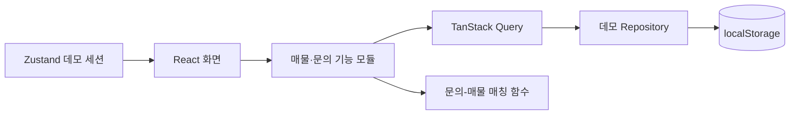

# RealConnect CRM

[](https://github.com/RealConnect-Start-up-Capstone-Design2/FE/actions/workflows/deploy.yml)

[](https://www.realconnect.co.kr)

[라이브 데모](https://www.realconnect.co.kr)에서 회원가입 없이 **데모 데이터로 둘러보기**를 선택하면 바로 사용할 수 있습니다.

공인중개사의 `문의 접수 → 매물 탐색 → 상담 기록 → 계약 관리`를 한 화면 흐름으로 연결한 업무 CRM 포트폴리오입니다. 별도 계정이나 운영 백엔드 없이 채용 담당자가 바로 핵심 시나리오를 확인할 수 있도록 익명 데모 모드를 제공합니다.

> 데모에 표시되는 사무소, 담당자, 연락처, 주소, 매물과 문의는 모두 포트폴리오용 샘플입니다. 데모 모드의 변경 사항은 현재 브라우저에만 저장되며 실제 중개 업무에 사용되지 않습니다.

## 해결하려는 문제

공인중개사는 한 고객의 요청을 처리하기 위해 문의 메모, 매물 정보, 상담 이력, 계약 상태를 여러 도구에서 오가게 됩니다. 이 과정에서는 조건에 맞는 매물을 놓치거나, 상담 맥락이 끊기거나, 후속 조치가 늦어지기 쉽습니다.

RealConnect CRM은 다음 세 가지에 집중합니다.

- 매물·고객 문의·상담·계약 정보를 하나의 업무 문맥으로 연결
- 문의 조건을 매물 조건과 비교해 우선 확인할 후보를 빠르게 제시
- 설치나 계정 생성 없이도 핵심 가치를 재현할 수 있는 결정적인 데모 제공

## 핵심 사용 흐름

1. 로그인 화면에서 **데모 데이터로 둘러보기**를 선택합니다.
2. 대시보드에서 매물, 진행 중 문의, 계약 상태를 요약해 확인합니다.
3. 매물장에서 검색·필터로 후보를 찾고 관심 매물을 표시합니다.
4. 매물 상세에서 조건을 확인하고 상담 내용과 점유·계약 정보를 기록합니다.
5. 문의장에서 고객 조건과 진행 상태를 관리하고 추천 매물을 비교합니다.
6. 새로고침 후에도 변경 내용을 이어서 보거나 샘플 데이터로 초기화합니다.

## 주요 기능

| 영역      | 제공 기능                                                                    |
| --------- | ---------------------------------------------------------------------------- |
| 데모 진입 | 회원가입 없는 원클릭 진입, 데모 모드 표시, 익명 샘플 데이터                  |
| 대시보드  | 동일한 데모 원장에서 계산한 업무 KPI와 후속 확인 항목                        |
| 매물장    | 검색, 조건 필터, 관심 표시, 상세 정보 편집, 상담 기록, 점유·계약 정보 관리   |
| 문의장    | 문의 등록·검색·상태 변경·삭제, 거래유형·위치·면적·가격 4축의 100점 추천 매물 |
| 데이터    | 브라우저 `localStorage` 저장, 스키마 버전 관리, 샘플 데이터 초기화           |

웹사이트 자동 생성, 결제, 공동중개, 관리자, 소셜 로그인처럼 완성되지 않았거나 이 포트폴리오의 핵심 흐름과 무관한 화면은 공개 범위에서 제거했습니다.

## 구조와 설계 선택



- **하나의 데이터 원장:** 대시보드 숫자, 매물 상세, 문의 추천이 같은 저장소를 바라보므로 화면 간 수치가 어긋나지 않습니다.
- **교체 가능한 데이터 경계:** 공개 포트폴리오는 로컬 데모 저장소를 사용하고, 실제 API 개발 시에는 환경 설정과 어댑터를 통해 연결할 수 있습니다.
- **검증 가능한 도메인 로직:** 문의-매물 점수와 집계 로직을 UI에서 분리해 Vitest로 빠르게 검증합니다.
- **결정적인 복구:** 스키마 버전과 초기화 경로를 두어 이전 브라우저 데이터 때문에 데모가 깨지지 않도록 설계했습니다.

주요 경로는 다음과 같습니다.

```text
src/
├─ demo/                     # 익명 seed, 저장소, 집계·매칭 로직
├─ features/
│  ├─ auth/                  # 데모 세션과 보호 라우트
│  ├─ propertyManage/        # 매물·상담·계약 업무
│  └─ inquiryManage/         # 문의 CRUD와 추천 매물
├─ pages/                    # 대시보드·매물장·문의장 조합
├─ shared/                   # 공통 UI, 레이아웃, API 경계
└─ routes.tsx                # 공개 포트폴리오 라우트
```

## 원본 팀 프로젝트와 포트폴리오 재구축

이 저장소의 출발점은 공인중개사 업무 지원 서비스를 만들던 캡스톤 팀 프로젝트입니다. 팀 프로젝트가 운영 가능한 상태까지 마무리되지 않은 뒤, 취업 포트폴리오에서는 핵심 CRM 경험을 독립적으로 평가할 수 있도록 범위를 다시 정했습니다.

| 구분              | 내용                                                                                           |
| ----------------- | ---------------------------------------------------------------------------------------------- |
| 원본 팀 프로젝트  | 프론트엔드와 백엔드를 분리한 공인중개사 업무 지원 서비스 개발                                  |
| 포트폴리오 재구축 | 웹빌더와 미완성 경로 제거, 백엔드 없는 익명 데모, 핵심 CRM 흐름 연결, 테스트·CI·보안·문서 정비 |

원본 팀 작업의 개인별 기여도를 이 문서에서 임의로 재구성하거나 개인 성과로 주장하지 않습니다. 변경 범위와 구현 근거는 브랜치의 커밋 및 Pull Request 기록으로 확인할 수 있습니다.

## 데모 데이터와 보안 경계

- 기본 실행은 `VITE_DATA_SOURCE`를 설정하지 않은 데모 모드입니다.
- 데모 데이터는 서버로 전송하지 않고 현재 브라우저의 `localStorage`에만 저장합니다.
- 초기 샘플은 2개 단지, 18개 매물, 8개 문의, 12개 상담, 4개 계약으로 구성됩니다.
- 브라우저 저장소는 편리한 시연 수단이지 실제 인증·권한·개인정보 보관 방식이 아닙니다.
- 실제 API를 개발할 때만 `.env.example`을 참고해 `VITE_DATA_SOURCE=api`와 `VITE_API_URL`을 함께 설정합니다.
- 공개 저장소와 기본 화면에는 실제 중개사 계정이나 고객 개인정보를 넣지 않습니다.

## 기술 스택

- React 19, TypeScript 5.8, React Router 7
- Vite 7, SWC, Tailwind CSS 4
- TanStack Query, Zustand
- Vitest, ESLint
- Node.js 24.21.0 LTS, pnpm 9.15.9
- GitHub Actions 품질 게이트, Vercel Git Integration

## 로컬 실행

요구 버전은 `.nvmrc`와 `package.json`에 고정되어 있습니다.

```bash
corepack enable
corepack prepare pnpm@9.15.9 --activate
pnpm install --frozen-lockfile
pnpm dev
```

기본 데모에는 환경 변수가 필요하지 않습니다. 개발용 API 어댑터를 연결할 때만 `.env.example`을 복사해 값을 설정합니다.

```bash
pnpm lint
pnpm test
pnpm build
pnpm preview
```

## 검증과 배포

| 검증             | 명령                             | 현재 결과                           |
| ---------------- | -------------------------------- | ----------------------------------- |
| 잠금 파일 재현   | `pnpm install --frozen-lockfile` | Node 24.21.0 / pnpm 9.15.9에서 통과 |
| 전체 의존성 감사 | `pnpm audit`                     | 취약점 0건                          |
| 코드 포맷        | `pnpm format:check`              | 통과                                |
| 정적 분석        | `pnpm lint`                      | 통과                                |
| 단위 테스트      | `pnpm test`                      | 9개 파일, 36개 테스트 통과          |
| 프로덕션 빌드    | `pnpm build`                     | 통과                                |

Pull Request와 `main` 푸시에서는 GitHub Actions가 동일한 버전으로 `install → format:check → lint → test → build`를 실행합니다. Preview와 Production 배포는 중복 CLI 배포 없이 기존 Vercel Git Integration이 담당합니다. `main` 보호 규칙에서는 **Quality Gate**가 필수 검사로 설정되어 있습니다.

배포 후에는 다음 시나리오를 수동으로 확인합니다.

- [ ] 시크릿 창에서 계정 없이 데모 대시보드 진입
- [ ] 매물 검색·필터·관심 표시 및 상세 변경
- [ ] 상담 기록과 점유·계약 정보 변경
- [ ] 문의 등록·상태 변경·삭제 및 추천 매물 확인
- [ ] 새로고침 후 변경 유지, 초기화 후 샘플 복원
- [ ] 모바일·데스크톱 주요 해상도에서 핵심 흐름 확인

## 현재 한계

- 공개 데모는 개인 브라우저 단위이므로 다중 사용자 협업이나 기기 간 동기화를 제공하지 않습니다.
- 실제 본인 인증, 중개사 자격 확인, 알림, 계약 문서, 결제는 포트폴리오 범위에 포함하지 않습니다.
- 실제 운영 전에는 서버 인증·권한, 데이터베이스, 감사 로그, 개인정보 암호화 및 보존 정책이 별도로 필요합니다.
